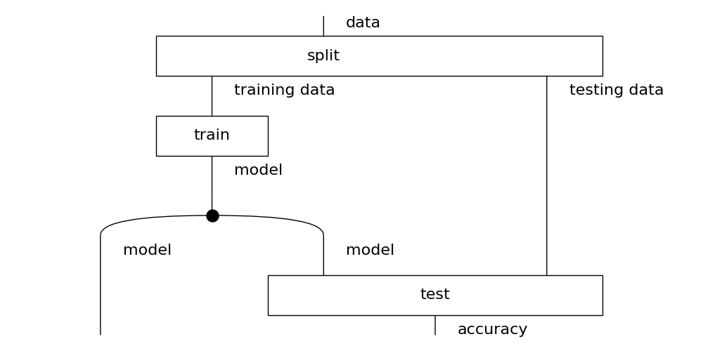
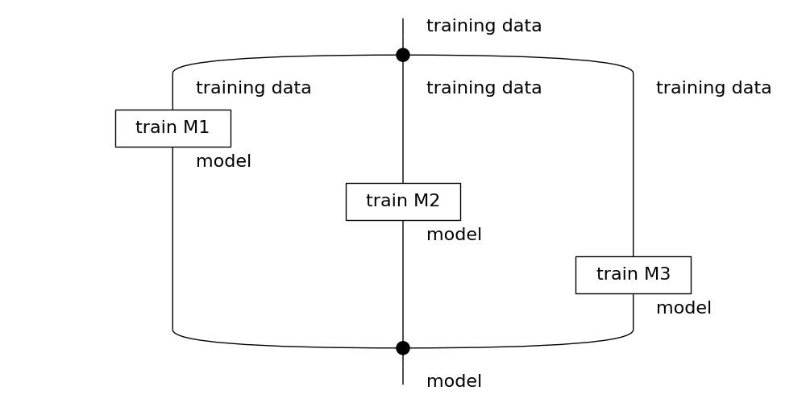
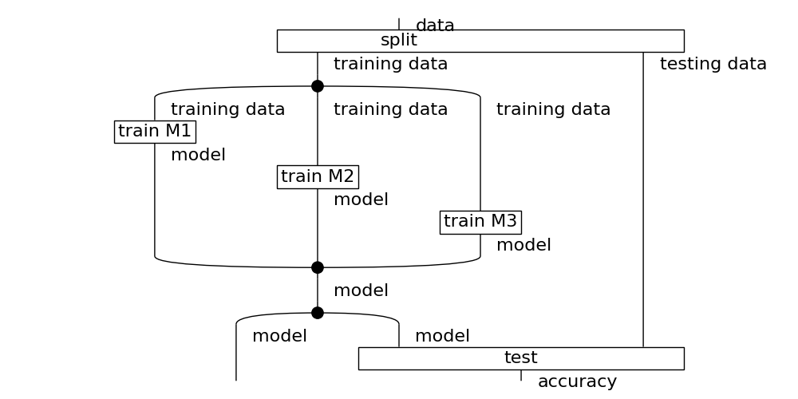
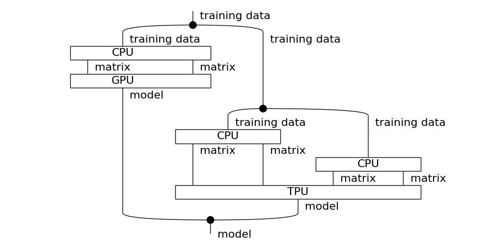
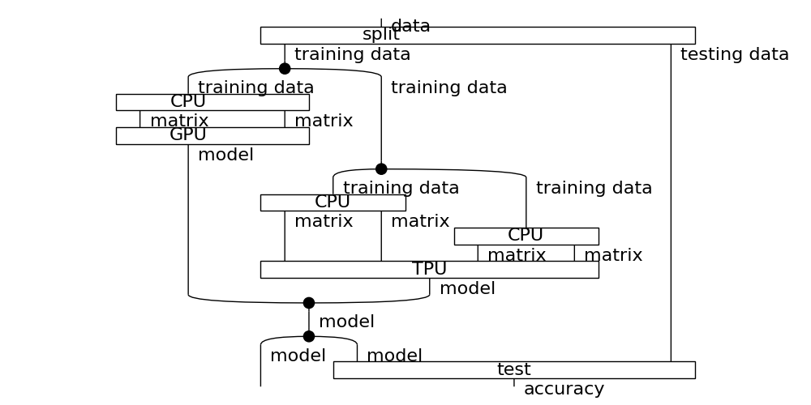

---
title:
- Diagramas de Cableado
author:
- Martin Coll
theme:
- Copenhagen
date:
- Club del Paper - 02/05/2024

---

# Intro

## Contexto

* La plata esta en AI
* Grandes proyectos de research
* Hardware heterogeneo (GPU, TPU)

## Objetivos

* Razonar diagramaticamente
* Componer y reescribir diagramas
* Reconocer aplicaciones a tecnologia existente

---

# Insalata di mascarpone

## Reconstruyendo la receta

Nuestro amigo Pawel nos dio un diagrama con su receta de crema de mascarpone pero se nos rompio y se nos hizo una ensalada de instrucciones.

{width=130px}
{width=130px}
{width=130px}
{width=130px}
{width=130px}
{width=130px}

---

# Todas las preguntas son bienvenidas
## Palabras prohibidas 1
* Funtor
* Categoria
* Objeto
* Morfismo
* Monoide
* Tensor

## Palabras prohibidas 2
* Variable
* Alfabeto
* Tipo
* Operacion
* Axioma
* Formula
* Ecuacion

---

# Todas las preguntas son bienvenidas
## Palabras prohibidas 3
* Funcion
* Conjunto
* Dominio
* Codominio
* Variable
* Operacion
* Tipo
* Clase

## Palabras prohibidas 4
* Grafo
* Automata
* Maquina de Estados
* Flujo
* Arbol Sintactico Abstracto

---

# Insalata di mascarpone
## Empezamos por el final
Notamos que `fold` tiene que ser el ultimo paso. Pero nos faltan ingredientes...

---

# Insalata di mascarpone
## `whisk` y `stir`

Por suerte encontramos las instrucciones para `whisked whites` y `thick paste` porque no tenemos ninguno de los dos en la heladera.

---

# Insalata di mascarpone
## Necesitamos dos huevos

La receta de `whisked whites` requiere dos claras, asi que vamos a usar dos huevos.

---

# Insalata di mascarpone
## Azucar, queso...

Con las dos yemas que sobraron, el azucar y el queso mascarpone preparamos `thick paste`

---

# Insalata di mascarpone
## La crema di mascarpone è pronta!

---

# Pipeline de datos

## Pipeline inicial

En esta segunda parte vamos a analizar un pipeline de datos estandar identificando oportunidades de optimizacion

---

# Pipeline de datos

## Tres modelos

Vamos a considerar un pipeline que tiene tres modelos

---

# Pipeline de datos

## Separando train en tres

Reemplazamos el paso `train` por el nuevo diagrama detallado

---

# Pipeline de datos

## Bajando de nivel

Volviendo al diagrama de los tres modelos logramos una optimizacion bajando de nivel de abstraccion

---

# Pipeline de datos

## Pipeline final

El diagrama deja todo preparado para la ejecucion o aplicacion de nuevas transformaciones.

---

# Revision

Gracias asistentes, organizadores y organizadora!

## Objetivos alcanzados
* Razonar diagramaticamente
* Componer y reescribir diagramas
* Reconocer aplicaciones a tecnologia existente

## Preguntas
* Se habilitan las preguntas tecnicas en general

## Chivo
* 21st International Conference on Quantum Physics and Logic
* Del 15 al 19 de julio
* En 0+inf

---

# Fin

Links:

* String Diagram Rewrite Theory I: https://arxiv.org/abs/2012.01847
* Pawel's blog: https://graphicallinearalgebra.net/2015/05/06/crema-di-mascarpone-rules-of-the-game-part-2-and-diagrammatic-reasoning/
* https://discopy.org
* https://qpl2024.dc.uba.ar
* __[Mi repo](https://github.com/colltoaction/qpl2024/blob/main/Club%20del%20Paper)__ con estas slides
