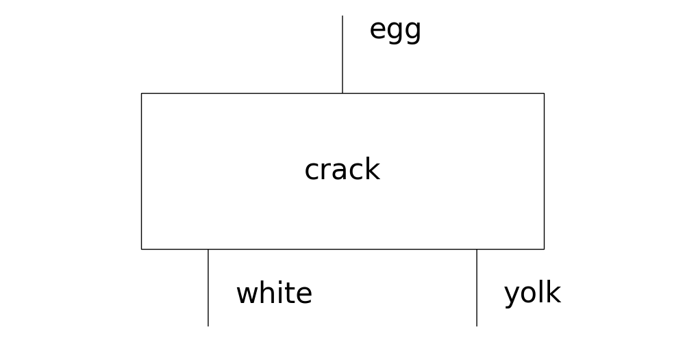
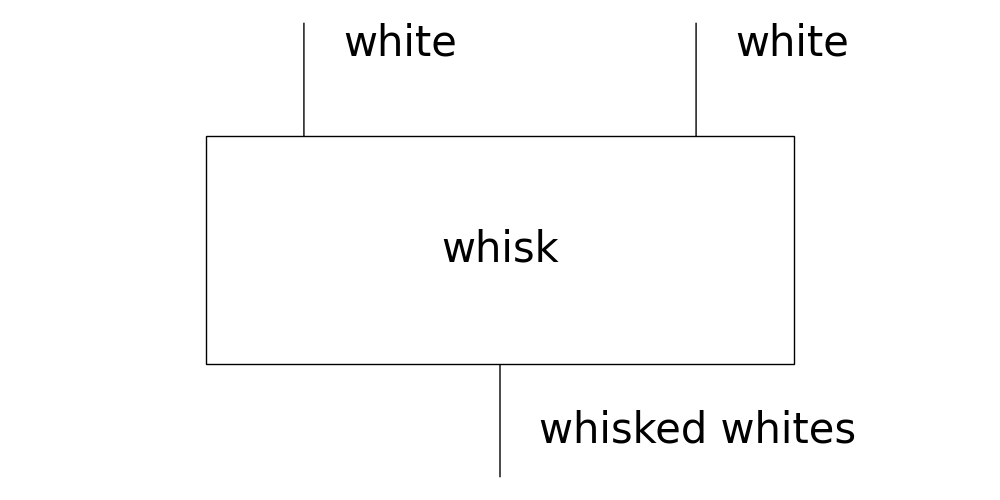
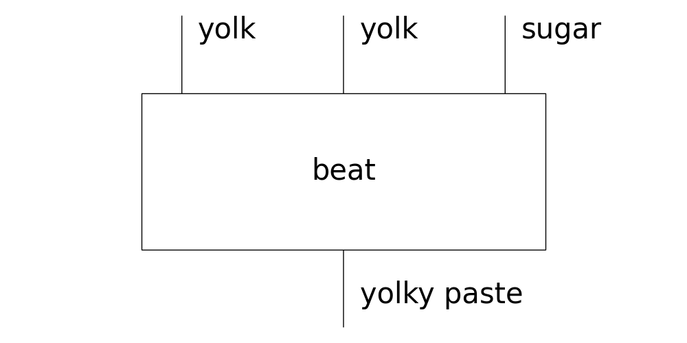
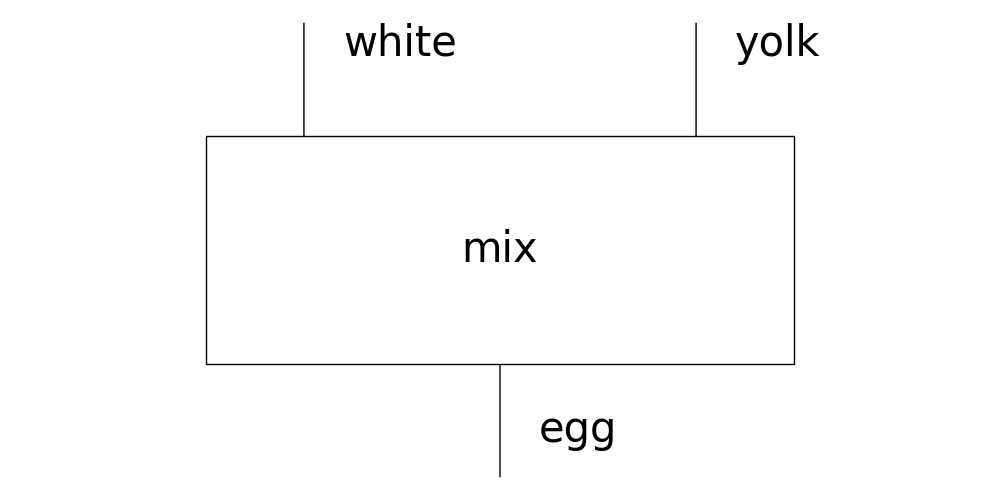
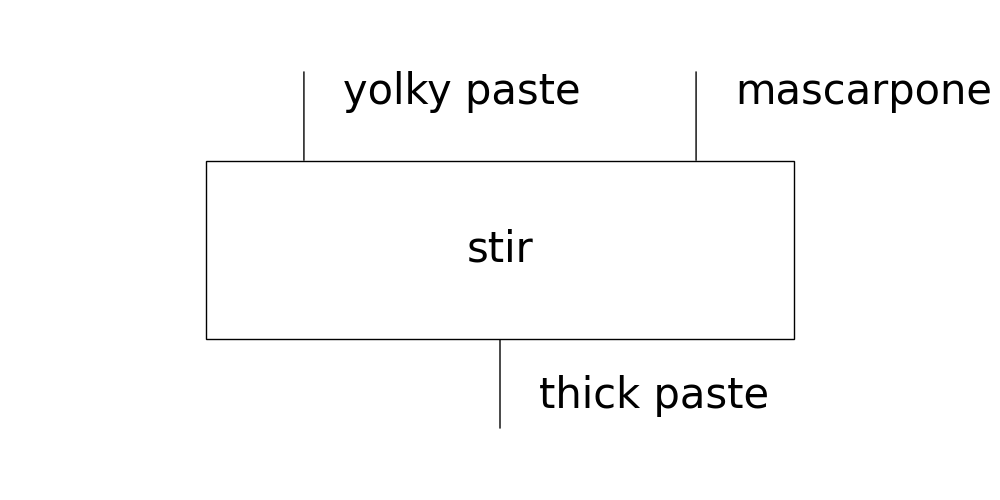
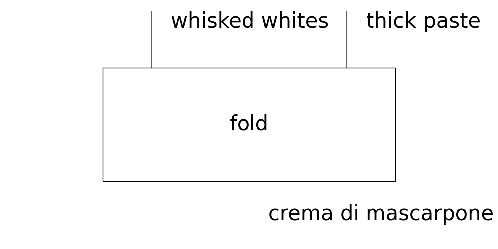
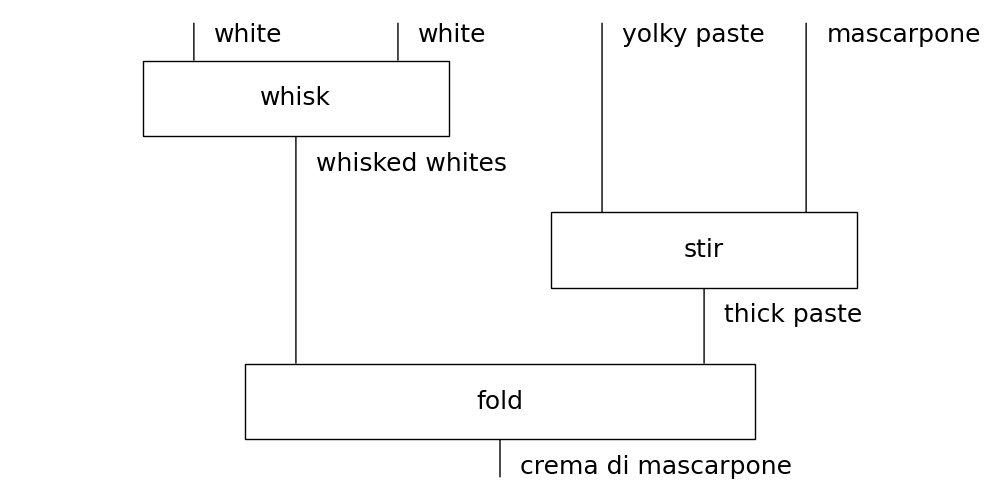
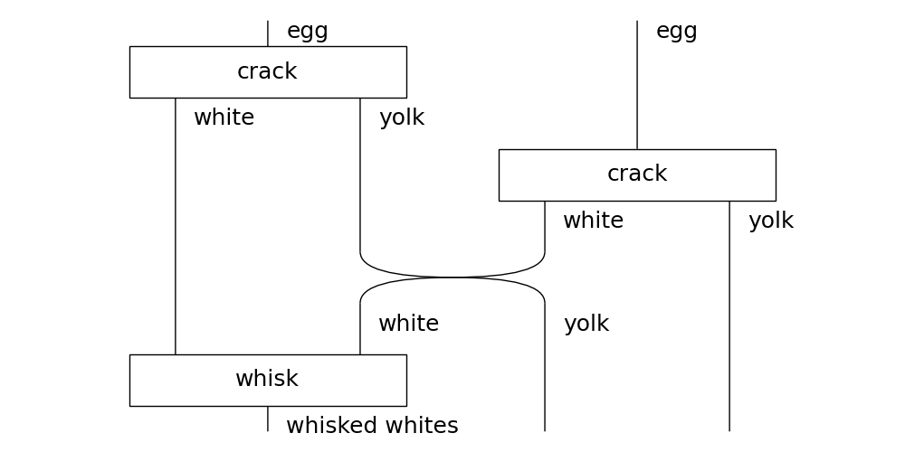
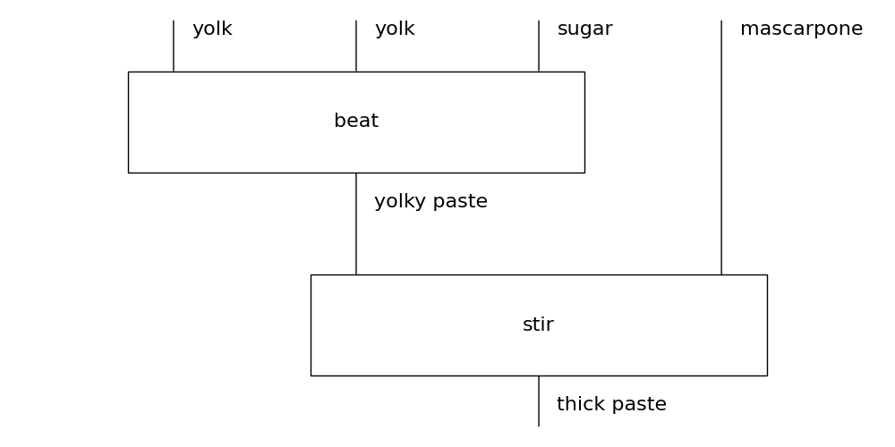
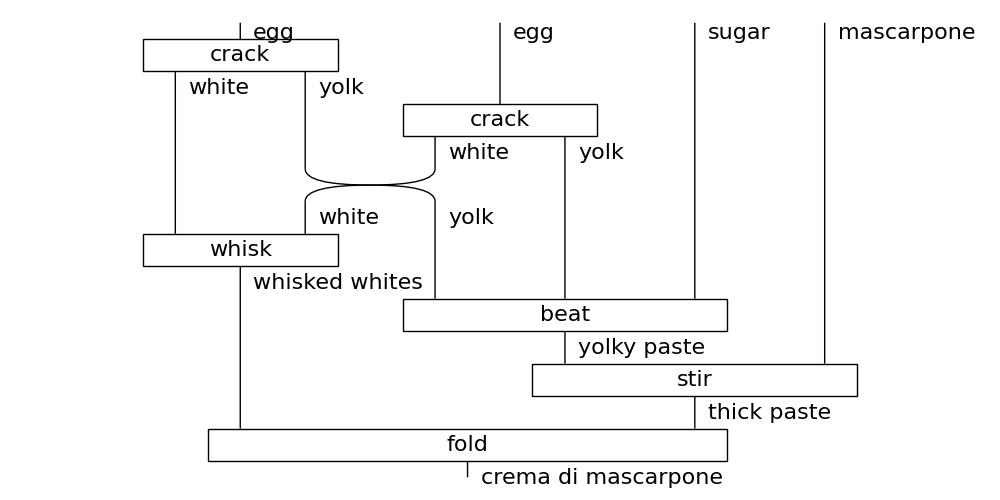

---
title:
- Diagramas de Cableado
author:
- Martin Coll
theme:
- Copenhagen
date:
- Club del Paper - 02/05/2024

---

# Intro a los diagramas
Old and new challenges for programmers: distributed systems, GPUs, custom hardware, composing large systems, circuits, formal properties, AI, Quantum.

Every programming language proposes a new syntax leading to unnecessary fragmentation.

Today Abstract Syntax Trees are the core abstraction of most compilers. The implementations grow more complex every day and the AST data structure falls short with respect to state of the art Computation.

Categorical IR. Meet CS and Math at the middle.

---

# Objetivos

Learn how to write diagrams using text and run programs.

* "diagrams" in the wild (graphs, state machines)
* read and draw
    * graphs are freely arrangeable
    * diagrams have an orientation
* write
    * text representation challenges
    * graph text formats
* programming
    * ASTs underpin compilers, interpreters
    * IRs
    * LISP data as code
    * diagrams natively represent programs
    * combinatorial vs categorical

---

# Parte 1 - Insalata di mascarpone

## Reconstruyendo la receta

Nuestro amigo Pawel nos dio un diagrama con su receta de crema de mascarpone pero se nos rompio y se nos hizo una ensalada de instrucciones separadas.

{width=130px}
{width=130px}
{width=130px}
{width=130px}
{width=130px}
{width=130px}

---

# Parte 1 - Todas las preguntas son bienvenidas
## Palabras prohibidas 1
* Funtor
* Categoria
* Objeto
* Morfismo
* Monoide
* Tensor

## Palabras prohibidas 2
* Variable
* Alfabeto
* Tipo
* Operacion
* Axioma
* Formula
* Ecuacion

---

# Parte 1 - Todas las preguntas son bienvenidas
## Palabras prohibidas 3
* Funcion
* Conjunto
* Dominio
* Codominio
* Variable
* Operacion
* Tipo
* Clase

## Palabras prohibidas 4
* Grafo
* Automata
* Maquina de Estados
* Flujo
* Arbol Sintactico Abstracto

---

# Parte 1 - Insalata di mascarpone
## Empezamos por el final
Notamos que `fold` nos da el resultado que buscamos. Pero nos faltan ingredientes...

---

# Parte 1 - Insalata di mascarpone
## `whisk` y `stir`

Por suerte encontramos las instrucciones para `whisked whites` y `thick paste` porque no tenemos ninguno de los dos en la heladera.

---

# Parte 1 - Insalata di mascarpone
## Necesitamos dos huevos

La receta de `whisked whites` requiere dos claras, asi que vamos a usar dos huevos.

---

# Parte 1 - Insalata di mascarpone
## Azucar, queso...

Con las dos yemas que sobraron, el azucar y el queso mascarpone preparamos `thick paste`

---

# Parte 1 - Insalata di mascarpone
## La crema di mascarpone è pronta!

---

# Referencias

* [String Diagram Rewrite Theory I](https://arxiv.org/abs/2012.01847)
* https://graphicallinearalgebra.net/2015/05/06/crema-di-mascarpone-rules-of-the-game-part-2-and-diagrammatic-reasoning/
