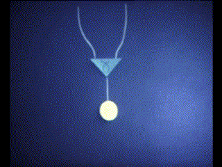
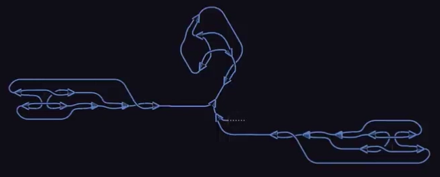
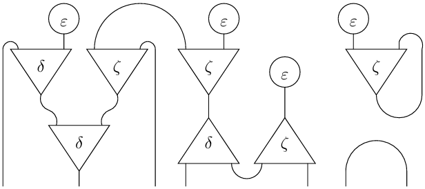

---
title:
- 'Inet Dialect: Declarative rewrite rules for interaction nets'
author:
- Martin Coll (@colltoaction)
institute:
- University of Buenos Aires
theme:
- Copenhagen
date:
- MLIR Open Design Meeting (April 10, 2025)

---

# Agenda

1. Understand graph-rewriting in the context of MLIR
1. Review prior art in Interaction Nets compilers and runtimes
1. Evaluate [Declarative Rewrite Rules](https://mlir.llvm.org/docs/DeclarativeRewrites/) in the implementation of the Inet dialect

---

# Graph rewriting

## Term rewriting alternative

Graph-rewriting is an alternative to traditional term-rewriting compilers. At its core, MLIR provides a declarative graph-rewriting framework to implement multi-level compilers.

## MLIR Declarative Rewrite Rules
MLIR rewrite rules are defined in a declarative manner via TableGen. Patterns provide a concise way to express graph rewriting as a source pattern to match and a resultant pattern to replace with.

---

# Graph rewriting

## Interaction Nets

Interaction nets are one of many computation models based on graph rewriting. They are as general as lambda calculus or turing machines. 

## Interaction nets

Interaction nets (Lafont, 1990) are a graphical syntax for deterministic distributed programs. They are both visual and formally defined using graph-rewriting rules.

{width=100px}
{width=100px}
{width=186px}

_Check out the original videos on a supported medium._

---

# Graph rewriting

These are the _all_ inet interaction rules we need:

## Commutations

{height=100px}

## Annihilations

{height=100px}

---

# Graph rewriting

## Example



---

# Prior art

## HVM2 + Bend
Bend is the Python-inspired frontend language for the HVM2 interaction combinator evaluator. It compiles an Interaction Net syntactic tree to efficient CUDA based on its parallel model.

## IVM + Vine
Vine is the Rust-inspired frontend language for the IVM interaction combinator runtime. Vine is compiled to Ivy, the IVM low-level intermediate representation, syntactically similar to MLIR.

---

# Prior art

## Community interest

Considering potential adoption versus maintenance cost, there is evidence of interest in YouTube programming channels, with videos for the Bend language with more than 1M views.

{height=200px}

---

# Implementation deep dive

## Standalone dialect prototype

We review the implementation of a lightweight dialect that supports formal programming at the core of MLIR. It is a standalone dialect with no dependencies on other dialects, native types or advanced MLIR features.

---

# Implementation deep dive

## Operations

The Inet dialect implements the three Symmetric Interaction Combinators `Erase`, `Construct` and `Duplicate` as operations.

## Operations Example

```
func.func @example(%arg0 : f64, %arg1 : f64) -> f64 {
  %a = inet.construct f64 %arg0 f64 %arg1 f64
  %b = inet.duplicate f64 %arg0 f64 %arg1 f64
  return %a + %b
}
```

---

# Implementation deep dive

## Co-operations

Including co-algebraic operations `CoErase`, `CoConstruct` and `CoDuplicate` greatly simplifies the definition of the rewrite patterns. Since Inets are defined in terms of undirected graphs, these combinators are added to integrate with MLIR's directed graph rewrite framework.

## Co-operations Example

```
func.func @coexample(%arg0 : f64, %arg1 : f64) -> f64 {
  %a, %b = inet.coduplicate f64 %arg0 f64, f64
  %c = inet.construct f64 %b f64 %arg1 f64
  %d = inet.construct f64 %a f64 %c f64
  return %d
}
```

---

# Implementation deep dive

## CoErase(Erase) annihilation pattern

```
def CoEraseEraseAnnihilation :
  Pattern<
    (Inet_CoEraseOp (Inet_EraseOp)),
    []>;
```

## Patterns

The interaction combinator rules are implemented by pattern matching on co-algebraic operations: `CoErase(Erase)`, `CoConstruct(Construct)` and `CoDuplicate(Duplicate)` for annihilation, and `CoErase(Construct)`, `CoErase(Duplicate)`, `CoConstruct(Erase)`, `CoDuplicate(Construct)`, `CoDuplicate(Erase)` and `CoConstruct(Duplicate)` for commutation.

---

# Implementation deep dive

## Original CoErase(Erase) annihilation

```
func.func @coerase_erase_annihilation() -> () {
  %a = inet.erase f64
  inet.coerase f64 %a
  return
}
```

## Rewritten CoErase(Erase) annihilation

```
func.func @coerase_erase_annihilation() -> () {
  return
}
```

---

# Implementation deep dive

## Original CoConstruct(Duplicate) commutation

```
func.func @coconstruct_duplicate_commutation(%arg0 : f64, %arg1 : f64) -> (f64, f64) {
  %a = inet.duplicate f64 %arg0 f64 %arg1 f64
  %b, %c = inet.coconstruct f64 %a f64, f64
  return %b, %c : f64, f64
}
```

## Rewritten CoConstruct(Duplicate) commutation

```
func.func @coconstruct_duplicate_commutation(%arg0 : f64, %arg1 : f64) -> (f64, f64) {
  %0:2 = inet.coconstruct f64 %arg0 f64, f64
  %1:2 = inet.coconstruct f64 %arg1 f64, f64
  %2 = inet.duplicate f64 %0#0 f64 %1#0 f64
  %3 = inet.duplicate f64 %0#1 f64 %1#1 f64
  return %2, %3 : f64, f64
}
```

---

# Future work

## Frontend language

The prototype shows that the MLIR rewrite framework is capable of supporting graphical calculus with a straightforward graph-rewriting approach. The dialect adds this support to the backend but as of now there is no frontend language.

---

# Future work

## Normalization

MLIR iteratively applies the canonicalization patterns in a greedy way. Inet rules are local and asynchronous ensuring this process is correct.

Further work is required to implement terminating normalization for recursive patterns. https://www.sciencedirect.com/science/article/pii/S0304397597000820.

---

# Future work

## Graphical monoidal languages

There is a surge of graphical languages, such as Interaction nets or the ZX-calculus in quantum computing. Monoidal languages stand out as they are mathematically solid and easy to reason about using visual intuition.

The growing demand for complex calculi in programming languages suggests looking at further abstractions for these kind of semantics. https://arxiv.org/abs/0908.3347.

---

# Future work

## GPU-accelerated compilation

The Interaction Net paradigm blurs the line between run- and compile-time. We would like to explore how the GPU acceleration techniques can be used to implement the compilation processes.

---

# Links and questions

* https://lipn.univ-paris13.fr/~mazza/papers/CombSem-MSCS.pdf
* Interaction Nets (1990): https://dlnext.acm.org/doi/10.1145/96709.96718
* Interaction Combinators (1997): https://www.sciencedirect.com/science/article/pii/S0890540197926432
* https://github.com/higherorderco/hvm
* https://github.com/VineLang/vine
* https://graphicallinearalgebra.net
* String Diagram Rewrite Theory I: https://arxiv.org/abs/2012.01847
* https://discopy.org
* Lafont stop motion: https://www.youtube.com/watch?v=_uIGQ1biCXY
* Fireship Code report: https://www.youtube.com/watch?v=HCOQmKTFzYY&t=7s
* Primeagen review: https://www.youtube.com/watch?v=NaytZOiX3fs
* __[Repo](https://github.com/colltoaction/writings/blob/main/MLIR%20Inet%20Dialect)__ with these slides
* Meeting announcement: https://discourse.llvm.org/c/mlir/mlir-announcements/44
