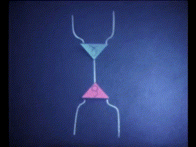
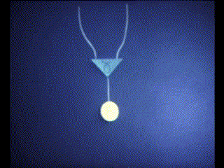
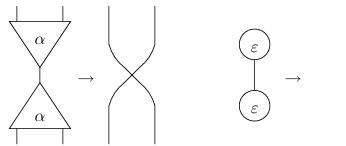
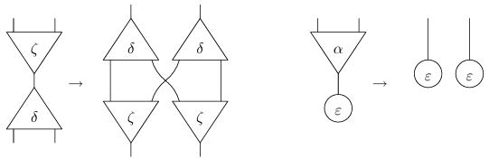

---
title:
- 'Inet Dialect: Declarative rewrite rules for interaction nets'
author:
- Martin Coll
theme:
- Copenhagen
date:
- MLIR Open Design Meeting - __/__/2025

---

# Abstract

## Interaction nets

Interaction nets (Lafont, 1990) are a graphical calculus based on graph rewriting. They are a programming paradigm for deterministic distributed computation recently popularized by the Bend language. We review an Inet dialect prototype that generalizes turing machines, cellular automata, and a number of word or term rewriting systems.

## Interaction animations
Check out these gifs and the [original video](https://www.youtube.com/watch?v=_uIGQ1biCXY) on a supported medium.

{width=160px}
{width=160px}

---

# Agenda

1. Understand the graph-rewriting computation model in the context of MLIR
1. Review the state of the art in Interaction Nets compilers and runtimes
1. Evaluate [Declarative Rewrite Rules](https://mlir.llvm.org/docs/DeclarativeRewrites/) for the implementation of Interaction Nets

---

# Graph rewriting

## MLIR Declarative Rewrite Rules

MLIR supports defining rewrite rules in a declarative manner via TableGen. Patterns provide a concise way to express graph rewriting as a pair of source pattern to match and resultant pattern. The declarative rewrite rule just contains the very essence of the rewrite. This makes it very easy to understand the pattern.

---

# Graph rewriting

## Interaction Nets

Interaction nets are one of many computation models based on graph rewriting. They are as general as lambda calculus or turing machines. 

## Interaction Combinators

A net is defined as an undirected graph of combinators and interactions between them.

---

# Graph rewriting

## Annihilations



## Commutations



---

# State of the art

## Bend
Bend is the Python-inspired frontend language for the HVM2 interaction combinator evaluator. It compiles an Interaction Net syntactic tree to efficient CUDA based on its parallel model.

## Vine
Vine is the Rust-inspired frontend language for the IVM interaction combinator runtime. Vine is compiled to Ivy, the IVM low-level intermediate representation, syntactically similar to MLIR.

---

# State of the art

## Community interest

Considering potential adoption versus maintenance cost, there is evidence of interest in YouTube programming channels, with videos for the Bend language with more than 1M views.

{height=70%}

---

# Implementation deep dive

## Standalone dialect prototype

The prototype shows that MLIR is capable of supporting graphical calculus with a straightforward graph-rewrite approach. The implementation is a standalone dialect with no dependencies on other dialects, native types or advanced features, it is a very general formal programming model for MLIR.

---

# Implementation deep dive

## Operations

The Inet dialect implements the three Symmetric Interaction Combinators `Erase`, `Construct` and `Duplicate` as operations. The inet evolves by matching pairs of active ports and rewriting the subgraph with both combinators according to the interaction rules.

## Co-operations
Since Inets are defined in terms of undirected graphs, we adapt the solution to play nicely with MLIR's declarative DAG rewrite framework. The dialect includes the co-algebraic counterpart operations `CoErase`, `CoConstruct` and `CoDuplicate`. This greatly simplifies the definition of the rewrite patterns avoiding some of the limitations of this framework.

---

# Implementation deep dive

## Patterns

The interaction combinator rules are implemented by pattern matching on co-algebraic operations: `CoErase(Erase)`, `CoConstruct(Construct)` and `CoDuplicate(Duplicate)` for annihilation, and `CoErase(Construct)`, `CoErase(Duplicate)`, `CoConstruct(Erase)`, `CoDuplicate(Construct)`, `CoDuplicate(Erase)` and `CoConstruct(Duplicate)` for commutation.

## CoErase(Erase) annihilation pattern

```
def CoEraseEraseAnnihilation :
  Pattern<
    (Inet_CoEraseOp (Inet_EraseOp)),
    []>;
```

---

# Implementation deep dive

## Original CoErase(Erase) annihilation

```
func.func @coerase_erase_annihilation() -> () {
  %a = inet.erase f64
  inet.coerase f64 %a
  return
}
```

## Rewritten CoErase(Erase) annihilation

```
func.func @coerase_erase_annihilation() -> () {
  return
}
```

---

# Implementation deep dive

## Original CoConstruct(Duplicate) commutation

```
func.func @coconstruct_duplicate_commutation(%arg0 : f64, %arg1 : f64) -> (f64, f64) {
  %a = inet.duplicate f64 %arg0 f64 %arg1 f64
  %b, %c = inet.coconstruct f64 %a f64, f64
  return %b, %c : f64, f64
}
```

## Rewritten CoConstruct(Duplicate) commutation

```
func.func @coconstruct_duplicate_commutation(%arg0 : f64, %arg1 : f64) -> (f64, f64) {
  %0:2 = inet.coconstruct f64 %arg0 f64, f64
  %1:2 = inet.coconstruct f64 %arg1 f64, f64
  %2 = inet.duplicate f64 %0#0 f64 %1#0 f64
  %3 = inet.duplicate f64 %0#1 f64 %1#1 f64
  return %2, %3 : f64, f64
}
```

---

# Implementation deep dive

## Canonicalization

MLIR has a single canonicalization pass, which iteratively applies the canonicalization patterns of all loaded dialects in a greedy way: https://mlir.llvm.org/docs/Canonicalization. This is perfect for the fully-local graph rewriting approach in Inets.

---

# Future work

## Frontend language

The prototype shows that the MLIR rewrite framework is capable of supporting graphical calculus with a straightforward term-rewriting approach. Implementors of frontend languages that want to hide the inet compilation backend could benefit from additional features:
* Variadic types
* Regions
* Interfaces
* Properties
* Attributes
---

# Future work

## Normalization

In the present prototype the canonicalization pass doesn't detect when to stop the compile-time rewriting, also called prereduction, since the algorithm is executed iteratively until fixed-point. To support this, further work is needed to develop terminating normalization. https://www.sciencedirect.com/science/article/pii/S0304397597000820.

---

# Future work

## Generalized algebraic dialect

The prototype is self-contained and centered in the Interaction Net paradigm. Some parts of this implementation are realizations of co-algebraic and monoidal semantics that could form a more abstract dialect.

## Graphical monoidal languages
Monoidal languages have risen as demand from complex calculi like the ZX-calculus in quantum computing. They are mathematically solid and easy to reason about using graphical intuition.


---

# Future work

## GPU compilation support

The Interaction Net paradigm blurs the line between run- and compile-time. We see that HVM2 can compile a CUDA-based evaluator but we can also consider using the same techniques at compilation time.

---

# Questions

---

# Links

* https://lipn.univ-paris13.fr/~mazza/papers/CombSem-MSCS.pdf
* Interaction Nets (1990): https://dlnext.acm.org/doi/10.1145/96709.96718
* Interaction Combinators (1997): https://www.sciencedirect.com/science/article/pii/S0890540197926432
* https://github.com/higherorderco/hvm
* https://github.com/VineLang/vine
* https://graphicallinearalgebra.net
* String Diagram Rewrite Theory I: https://arxiv.org/abs/2012.01847
* https://discopy.org
* __[Repo](https://github.com/colltoaction/writings/blob/main/MLIR%20Inet%20Dialect)__ with these slides
