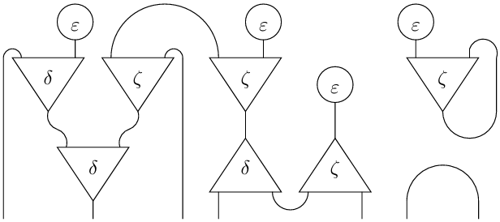

---
title:
- MLIR Inet Dialect
author:
- Martin Coll
theme:
- Copenhagen
date:
- Open Design Meeting - __/__/2025

---

# Abstract

## Interaction nets (Lafont, 1990)

Interaction nets are a graphical calculus based on graph rewriting. They are a programming paradigm for deterministic distributed computation recently popularized by the Bend language. We review an Inet dialect prototype that generalizes turing machines, cellular automata, and a number of word or term rewriting systems.

---

# Agenda

* Interaction nets graphical calculus
    * Universal model of deterministic distributed computation
    * Abstracts many variants of
        * Lambda calculus
        * Linear logic
        * Turing machines
* State of the art
    * Bend + HVM2
        * GPU evaluation
    * Vine + IVM
* Graph rewriting deep dive
    * Fully-local
    * to normal form as compilation
    * for evaluation at runtime
    * SSA CFGs vs undirected combinator graphs
* Implementation deep dive
    * Rewrite-based TableGen implementation
        * Decoupled from numeric or native types
        * Operation-oriented
    * Co-combinators
        * coalgebras vs active-aux ports
        * no explicit linking ops

---

# Objectives

* Domain-specific compiler for combinator runtimes
* Consider potential adoption versus maintenance cost

---

# Canonicalization

* MLIR has a single canonicalization pass, which iteratively applies the canonicalization patterns of all loaded dialects in a greedy way: https://mlir.llvm.org/docs/Canonicalization. This is perfect for the fully-local graph rewriting approach in Inets.
* It applies patterns until either fixpoint is reached or the maximum number of iterations/rewrites is exhausted.

CHECK: Pattens with expensive running time (i.e. have O(n) complexity) or complicated cost models don’t belong to canonicalization: since the algorithm is executed iteratively until fixed-point we want patterns that execute quickly (in particular their matching phase).

> Interaction and termination, which ensures that all reduction sequences are finite. Interaction nets are confluent "by construction". This is not the case in general for term rewriting systems. Termination however is not guaranteed for arbitrary interaction nets.
> https://www.sciencedirect.com/science/article/pii/S0304397597000820.

---

# Future work

* Explore MLIR dialect capabilities
    * Regions
    * Interfaces
    * Properties
    * Attributes
    * Variadic types
* Frontend language implementation
* Generalized algebraic dialect
    * Graphical monoidal languages
* GPU runtime and compiler

---

# Questions

---

# Links

* https://lipn.univ-paris13.fr/~mazza/papers/CombSem-MSCS.pdf
* Interaction Nets (1990): https://dlnext.acm.org/doi/10.1145/96709.96718
* Interaction Combinators (1997): https://www.sciencedirect.com/science/article/pii/S0890540197926432
* https://github.com/higherorderco/hvm
* https://github.com/VineLang/vine
* https://graphicallinearalgebra.net
* String Diagram Rewrite Theory I: https://arxiv.org/abs/2012.01847
* https://discopy.org
* __[Repo](https://github.com/colltoaction/writings/blob/main/MLIR%20Inet%20Dialect)__ with these slides
