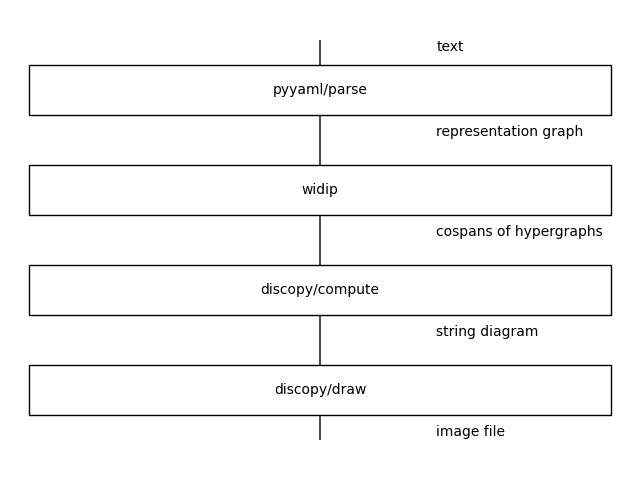

# Widip: An Open-source Computing System for String Diagrams

Subjects: Programming Languages (cs.PL); Logic in Computer Science (cs.LO); Mathematical Software (cs.MS)

Author: Martin Coll, Buenos Aires

## Abstract
We present the Widip Open-source Computing System for String Diagrams. We motivate our work in their equivalence as syntax with the Cospans of Hypergraphs computing structures and its relation to the LISP Programming System.

## Introduction

In String Diagram Rewrite Theory [[BGK+]] we see _symbolic computation_ from a new perspective. The authors show that the syntax of **String Diagrams** can be regarded as computation under the **Rewrite Theory** of **Cospans of Hypergraphs**.

The LISP Programming System [[McC]] modelled a similar framework for the AI group at MIT. An important decision was to define programs in the same class of symbolic expressions, as that "has advantages both as a programming language and as vehicles for developing a theory of computation".

It is straightforward to rethink the LISP graphically but users expect new tools to integrate with their environments including workstations and servers. This factor leads us to working with The UNIX Time-Sharing System [[RT]]. We will evaluate this solution with the Design Principles Behind Smalltalk [[Ing]] research on programming languages and user interfaces.

## Implementation
We write the `widip` program, an interactive UNIX Shell. It is implemented in Python using the `discopy` and `pyyaml` packages. We use the YAML data language to model string diagrams and use the DisCoPy toolkit for computing [[FTC]] and drawing image files. The following is the system diagram where the box named "widip" is our implementation:

{width="80%"}

The diagram above is the system as represented by the system. It is stored in a file with the following text:

```yaml
- !unix/read file: text
- !pyyaml/parse text: representation graph
- !widip representation graph: cospans of hypergraphs
- !discopy/compute cospans of hypergraphs: string diagram
- !discopy/draw string diagram: image
- !unix/write image: file
```

## Future work
We would like to implement the Run language from Programs as Diagrams [[Pav]] as part of the Widip computing system. We are also interested in evaluating the Catlab package discussed in [[PSV]] for compiling to native code.

## References
* [[FTC]] Giovanni de Felice, Alexis Toumi, Bob Coecke. DisCoPy: Monoidal Categories in Python. EPTCS 333, 2021, pp. 183-197.
* [[BGK+]] Filippo Bonchi, Fabio Gadducci, Aleks Kissinger, Pawel Sobocinski, and Fabio Zanasi. String Diagram rewrite theory I: Rewriting with Frobenius structure. Journal of the ACM, 69(2):14:1–14:58, 2022.
* [[YAML]] YAML Language Development Team. YAML Ain’t Markup Language. Revision 1.2.2 (2021-10-01).
* [[McC]] John McCarthy. Recursive functions of symbolic expressions and their computation by machine. Communications of the ACM, Volume 3, Issue 4, pp 184–195.
* [[Ing]] Daniel Ingalls. Design Principles Behind Smalltalk. BYTE Magazine, August 1981.
* [[Pav]] Dusko Pavlovic. Programs as Diagrams: From Categorical Computability to Computable Categories.
* [[RT]] Dennis Ritchie, Ken Thompson. The UNIX Time-Sharing System. Fourth ACM Symposium on Operating Systems Principles. October 15–17, 1973.
* [[PSV]] Evan Patterson, David Spivak, Dmitry Vagner. Wiring diagrams as normal forms for computing in symmetric monoidal categories. Applied Category Theory 2020 (ACT2020). EPTCS 333, 2021, pp. 49–64, doi:10.4204/EPTCS.333.4

[FTC]: https://doi.org/10.4204/EPTCS.333.13
[BGK+]: https://doi.org/10.48550/arXiv.2012.01847
[YAML]: https://yaml.org/spec/1.2.2/
[PyYAML]: https://github.com/yaml/pyyaml
[McC]: https://dl.acm.org/doi/10.1145/367177.367199
[Ing]: https://www.cs.virginia.edu/~evans/cs655/readings/smalltalk.html
[Pav]: https://arxiv.org/abs/2208.03817
[RT]: https://dsf.berkeley.edu/cs262/unix.pdf
[PSV]: https://doi.org/10.4204/EPTCS.333.4
