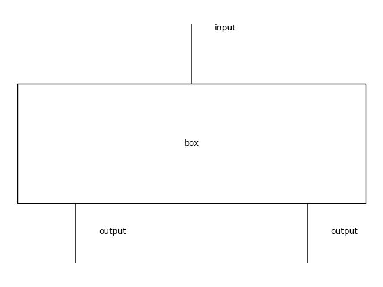
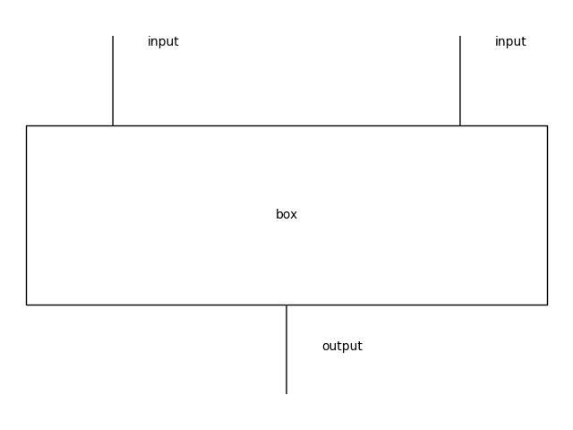
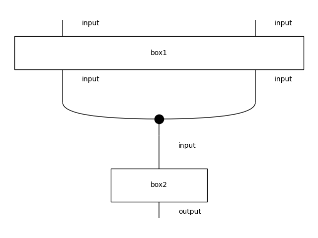

# YAML HOL

Subjects: Logic in Computer Science (cs.LO); Mathematical Software (cs.MS)

Author: Martin Coll, Buenos Aires

## Abstract

This project gives an interoperable string diagram specification based on the YAML language. Using monoidal semantics it enriches this popular data language with programming capabilities. We publish a Python package that uses PyYAML and DisCoPy to generate, draw and compute string diagrams.

## Motivation

YAML is a popular data language with uses in application configuration, network definition, security policies, and more. It makes it possible to write friendly yet complex data structures made of lists, dictionaries and scalars.

All mainstream programming languages have native support and developers write primitives to that turn YAML into domain-specific languages. These programs can display a wide range of behavior without any changes to code. There is however a constant tension between simple rules and complex behavior.

## Implementation
We build this tool with the intention of creating a general-purpose language. We blur the distinction between programs and data in the spirit of functional programming languages and use category theory to support complex compositional patterns.

### Semantics
In its 1.2.2 specification[6], a YAML document has scalars and two composition types: lists and mappings. We make the obvious choice of modeling sequential composition `;` with lists and parallel composition `⊕` with mappings.

The following examples show the mathematical, DisCoPy, YAML and diagrammatic representations of two simple boxes.
```
box = input ; ( output ⊕ output )
```
```py
Box("box", Ty("input"), Ty("output") @ Ty("output"))
```
```yaml
!box [ input, { output: , output: } ]
```

```
box = (input ⊕ input) ; output
```
```py
Box("box", Ty("input") @ Ty("input"), Ty("output"))
```
```yaml
!box [ { input: , input: }, output ]
```


We chose to support all YAML documents as diagrams but monoidal categories alone would not represent valid equations. We add a Frobenius structure that is able to turn any YAML text file into a look-alike diagram.
This means users can immediately draw and start tinkering with their existing documents.

```yaml
- !box1
  input:
  input:
- !box2
  input: output
```


The diagram above has automatically connected the wires between boxes even when the arities didn't match. Frobenius structure simplifies bureaucracy and achieves our goals.

## Future work

We want to explore an integration with the filesystem to help building diagrams. We currently handle one file at a time and need to write Python code for composing larger diagrams. This addition can provide a solid foundation to write the compositional parts of a program and restrict traditional programming languages to specific tasks.

The AlgebraicJulia[5] project has many tools for Applied Category Theory including string diagrams. We would like to explore how to make this available in the Julia ecosystem as well.

[1]: https://arxiv.org/abs/2005.02975
[2]: https://arxiv.org/abs/2012.01847
[3]: https://joss.theoj.org/papers/10.21105/joss.05162
[4]: https://arxiv.org/abs/2310.11626
[5]: https://arxiv.org/abs/2005.04831
[DisCoCat]: https://arxiv.org/abs/1003.4394
[6]: https://yaml.org/spec/1.2.2/
[PyYAML]: https://github.com/yaml/pyyaml
[DisCoPy]: https://github.com/discopy/discopy